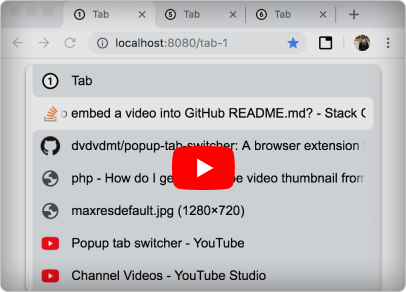
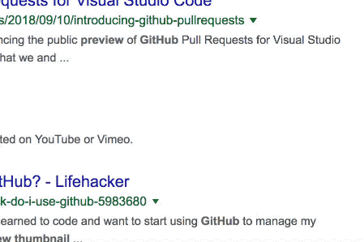
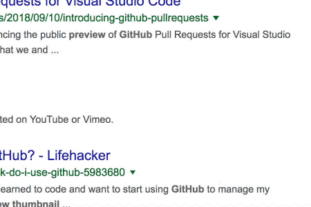

# Popup tab switcher

A browser extension that makes switching between tabs more convenient. Available in
[Chrome web store](https://chrome.google.com/webstore/detail/popup-tab-switcher/cehdjppppegalmaffcdffkkpmoflfhkc)
.

It remembers the order in which tabs were active and allows you to switch between recently active
tabs in a fraction of a second without using a mouse.

## Motivation

My everyday code editor from JetBrains has a handful popup (Settings > Keymap > Switcher) that
simplifies switching between editor's tabs. A similar switcher is build into all modern operating
systems, which allows you to jump between apps and it can be triggered by pressing `Alt+Tab` in
Windows and `Cmd+Tab` in macOS. The project is copying this behaviour to the Chrome browser.

## How to use

Default shortcuts to trigger the extension are:

<ul>
  <li>
    <code>Alt+Y</code> to select tabs from top to bottom (recent to old)
    

demo

      
    
 
  </li>
  <li>
    <code>Alt+Shift+Y</code> to select tabs from bottom to top (old to recent)
    

demo

      
    
 
  </li>
</ul>

After you selected necessary tab, release the `Alt` key to activate it.  
You can press `Escape` or click on the space around popup to hide it.

When you close a tab the extension will switch you to the previously active one. It is more helpful
than the default Chrome behaviour, which activates the adjacent tab.

## Restrictions

The extension tries to render its popup on the page wherever it is possible, but there are cases
where it can't do that:

- Chrome's web store pages. The extension doesn't work here.
- Special Chrome tabs such as Settings, New tab, History, etc. In this case the extension tries to
  switch a user from a special tab to a previous tab without showing a popup.
- The page has no focus (a user searches on the page, focused on address bar, etc.). In this case
  the extension shows its popup and starts a timer by the end of which it will switch a user to the
  selected tab.
- File pages (URL starts with `file:///`). The extension can't work on such pages without a special
  permission which you can turn on in Extensions > Popup Tab Switcher (Details) > Allow access to
  file URLs.

## Help

### Settings

You can open the extension settings by clicking on its icon near the address bar.

| Option                          | Description                                                                                                                                                                                                                                                |
| ------------------------------- | ---------------------------------------------------------------------------------------------------------------------------------------------------------------------------------------------------------------------------------------------------------- |
| Dark theme                      | Turns on or off the dark theme 🦇                                                                                                                                                                                                                          |
| Popup width                     | Sets the popup width                                                                                                                                                                                                                                       |
| Popup height                    | Sets the popup height                                                                                                                                                                                                                                      |
| Max number of tabs              | Specifies how many recently used tabs to show in the popup                                                                                                                                                                                                 |
| Font size                       | Sets the size of the tab title text                                                                                                                                                                                                                        |
| Icon size                       | Sets the size of the tab icon                                                                                                                                                                                                                              |
| Auto switching timeout          | If a page has no focus (address bar or search field is focused, etc.) then the extension starts a timer by the end of which it will switch a user to the selected tab. This timer restarts on each selection command (`Alt+Y` or `Alt+Shift+Y` by default) |
| Text scroll delay               | If a tab title is wider than the popup then its overflowing part will be hidden. When such a tab is selected its text will be scrolled. This option delays the start of the scrolling                                                                      |
| Text scroll speed               | Sets the speed of a selected tab text scrolling                                                                                                                                                                                                            |
| Switch to a previously used tab | Switch to a previously active tab when a current one closes                                                                                                                                                                                                |
| Stay open                       | The switcher stays open and stops switching tabs on a modifier key release                                                                                                                                                                                 |

### Replace default tab switching behaviour

Default Chrome tab switching shortcuts are `Ctrl+Tab` and `Ctrl+Shift+Tab`. These shortcuts can not
be assigned to trigger the extension commands (Extensions > Keyboard shortcuts
`chrome://extensions/shortcuts`). In order to switch between tabs on `Ctrl+Tab` by using the
extension you can try one of the next approaches.

> NOTE: For the moment I know how to do it only for macOS, but I think that solution for Windows is
> similar and can be done with [AutoHotkey](https://www.autohotkey.com/).

#### macOS

##### Using Karabiner-Elements

[Karabiner-Elements](https://pqrs.org/osx/karabiner/index.html) is a free keyboard customizer for
macOS. After its installation you need to place
[this config file](https://github.com/dvdvdmt/my-configs/blob/master/karabiner/Chrome_Ctrl-Tab_to_Alt-Y.json)
to `~/.config/karabiner/assets/complex_modifications/` and enable this modification in
Karabiner-Elements Preferences (Complex Modifications > Add rule > Maps switching between tabs in
Chrome...). Karabiner has a bug that causes releasing `Ctrl` key on mouse movements
([details](https://github.com/pqrs-org/Karabiner-Elements/issues/978)), this results on instant
switching to another tab on mouse movements when the popup is open.

##### Using Keyboard Maestro

[Keyboard Maestro](https://www.keyboardmaestro.com/main/) is a powerful macro runner for macOS. The
solution with Keyboard Maestro works, but is not ideal, because it starts timers in a background.
You can find necessary macros in
[this forum question](https://forum.keyboardmaestro.com/t/how-to-map-one-key-combination-with-modifier-key-to-another/14385?u=dmitriy_davydov)
.

## FAQ

> Is there a way to change the default shortcut (Alt+Y)?

Yes you can do this in Chrome (Extensions > Keyboard shortcuts `chrome://extensions/shortcuts`)

## Contributors

Design of the icon and promo images - [Alina Zaripova](https://www.behance.net/alicilinia)
