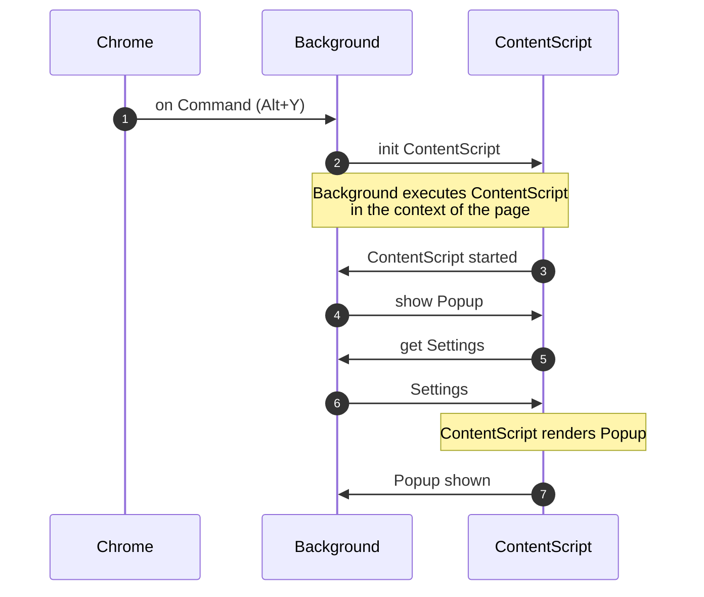

## Popup rendering

The initial rendering of the content script on the page is the most important part of the extension
performance. Here is the diagram of communication between the Background (web-worker) and the
Content Script main thread (browser page).

As you can see from the diagram there are 4 interactions (from 3 to 6) between the Background and
the ContentScript before its rendering is complete. The removal of those interactions may
significantly improve the performance of the extension and requires more investigation.
