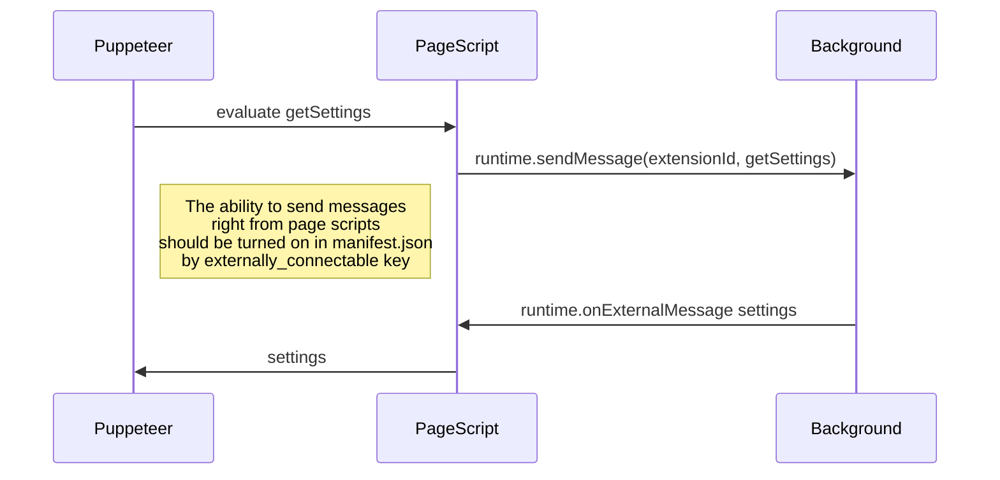
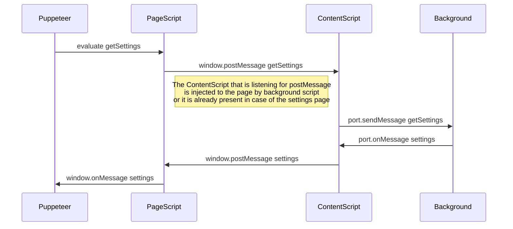

## How to run e2e tests inside docker container?

1. Build [puppeteer-headful](https://github.com/mujo-code/puppeteer-headful) image

```shell
git clone https://github.com/mujo-code/puppeteer-headful.git
```

or faster

```shell
npx degit mujo-code/puppeteer-headful puppeteer-headful
```

```shell
docker build -t puppeteer-headful ./puppeteer-headful
# For Apple M1 this will fail
```

2. Build e2e tests

```shell
npm run build:e2e
```

3. Run tests in container

```shell
docker container run -it --mount type=bind,source="$(pwd)",target=/app -w=/app puppeteer-headful npm run test:e2e
```

## Communication with extension

There are two ways of communication between extension and Puppeteer. The first one is using
[externally_connectable](https://developer.chrome.com/docs/extensions/mv3/manifest/externally_connectable/)
key to allow sending messages using `runtime.sendMessage(extensionId, payload)` right from the
PageScript.



The problem with `externally_connectable` is that it requires specification of a web-page domain to
enable `runtime.sendMessage` API. In case of E2E tests there are multiple file pages that can't be
specified in `externally_connectable.matches`.

To overcome this restriction `window.postMessage` mechanism could be used.



The problem with `window.postMessage` mechanism is that you can't differentiate between messages
that come from PageScript and ContentScript because their `event.origin` are equal. To overcome this
we can differentiate senders looking into the payload data. This way PageScript will handle only
messages that don't have `type` key and ContentScript will handle messages that have `type` key.
